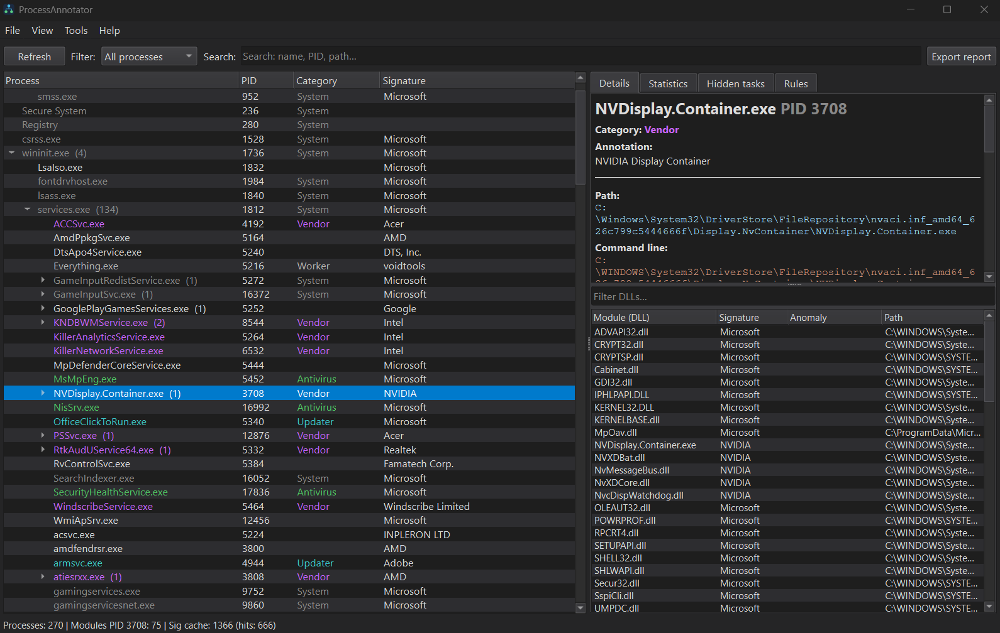

# ProcessAnnotator

**Process tree with explanations** — a lightweight Windows diagnostic tool that shows *what processes are running and why*, with human-readable annotations.

Not a Process Hacker / Process Explorer clone. Not an antivirus.  
Focus: **annotate and explain**, not manage or “clean” the system.

[Русский](#русский) · [English](#english)

---

<a id="english"></a>
## English

### Screenshot



Add a window capture as `docs/tree.png` before publishing.

### What it does

- **Process tree** (parent → child) with PID, path, command line
- **YAML knowledge base** — annotations like “browser worker”, “telemetry”, “updater”
- **Digital signatures** (including Windows catalog signatures) + cache
- **Loaded modules (DLLs)** with signature status and simple path anomalies
- **Search** by name, PID, path, hash, annotation (space = AND, comma = OR; `pid:1234` = exact PID)
- **Snapshot diff** on refresh (new / exited processes)
- **Category statistics**
- **Autostart lookup** for the selected image (Run keys, services, scheduled tasks)
- **Hidden scheduled tasks** list
- **Optional VirusTotal** lookup by SHA-256 (only when you ask; API key stored locally)
- **Export** text / HTML report
- **UI**: dark / light / system theme, English / Russian

Analysis is **local by default**. Network is used only for optional VirusTotal requests.

### Requirements

- Windows 10 / 11 (x64)
- For building: Visual Studio 2022, CMake 3.20+, Qt 6 (MSVC kit)

Administrator rights are **not required** for basic use. Elevation helps with more system processes, services, and full task lists.

### Build

From the project root (discovers Qt or uses a saved path / `QTDIR`):

```bat
build.bat
build.bat "D:\Qt\6.11.1\msvc2022_64"
build.bat --clean
```

The Qt prefix is remembered in `qt-prefix.txt` (gitignored). Release output: `build\Release\ProcessAnnotator.exe`.

Manual CMake:

```bat
mkdir build
cd build
cmake .. -G "Visual Studio 17 2022" -A x64 -DCMAKE_PREFIX_PATH="C:/path/to/Qt/6.x.x/msvc2022_64"
cmake --build . --config Release
```

After build, copy Qt runtime DLLs if needed (`windeployqt ProcessAnnotator.exe`).  
Rules are copied next to the executable: `rules/rules.yaml` and `rules/rules.d/`.

### Custom rules

1. Put extra YAML files into:

   ```text
   <exe_dir>/rules/rules.d/*.yaml
   ```

2. Required shape:

   ```yaml
   rules:
     - id: my_app
       priority: 150
       match:
         name_equals: "MyApp.exe"
       annotation: "Моё приложение"
       annotation_en: "My application"
       category: vendor
   ```

3. In the app: **Rules → Reload rules** (or restart).

Higher `priority` wins when several rules match.  
On a tie: `rules.d/` beats `rules.yaml`, then file name, then `id`. Prefer unique `id` values.

Categories (examples): `system`, `telemetry`, `updater`, `antivirus`, `browser_worker`, `worker`, `vendor`, `suspicious`.

### Privacy & safety

- No telemetry from the app itself
- VirusTotal is **opt-in** and runs only on explicit user action
- Signature / hash caches are stored in `%LOCALAPPDATA%\ProcessAnnotator`
- Some antivirus products may flag process-inspection tools heuristically (unsigned builds especially). Add a folder exclusion while developing if needed

### What it is not

- Not a replacement for Process Explorer / System Informer for handles, real-time CPU graphs, etc.
- Does not kill processes or “fix” malware automatically
- Does not claim malware verdicts (annotations are educational / triage hints)

### License

MIT — see [LICENSE](LICENSE).

---

<a id="русский"></a>
## Русский

### Скриншот


Перед публикацией положите снимок окна в `docs/tree.png`.

### Что это

**Дерево процессов с пояснениями** — лёгкий диагностический инструмент для Windows: показывает *какие процессы запущены и зачем*, с понятными аннотациями.

Это не клон Process Hacker / Process Explorer и не антивирус.  
Смысл: **объяснить**, а не «лечить» и не управлять системой как диспетчер задач на стероидах.

### Возможности

- **Дерево процессов** (родитель → потомок), PID, путь, command line
- **База правил YAML** — аннотации («worker браузера», «телеметрия», «апдейтер» и т.д.)
- **Цифровые подписи** (в т.ч. catalog Windows) + кэш
- **Модули (DLL)** с подписью и простыми аномалиями пути
- **Поиск** по имени, PID, пути, хэшу, аннотации (пробел = И, запятая = ИЛИ; `pid:1234` = точный PID)
- **Сравнение снимков** при обновлении (новые / завершившиеся)
- **Статистика по категориям**
- **Автозагрузка** для выбранного exe (Run, службы, задачи планировщика)
- Список **скрытых scheduled tasks**
- **VirusTotal** по желанию (SHA-256; ключ только локально)
- **Экспорт** текстового / HTML-отчёта
- **Интерфейс**: тёмная / светлая / системная тема, русский / English

По умолчанию всё **локально**. Сеть — только если вы сами запросили VirusTotal.

### Требования

- Windows 10 / 11 (x64)
- Для сборки: Visual Studio 2022, CMake 3.20+, Qt 6 (набор MSVC)

Запуск **от администратора не обязателен** для базового просмотра. Админ даёт больше данных по системным процессам, службам и задачам.

### Сборка

Из корня проекта (ищет Qt или берёт сохранённый путь / `QTDIR`):

```bat
build.bat
build.bat "D:\Qt\6.11.1\msvc2022_64"
build.bat --clean
```

Путь к Qt запоминается в `qt-prefix.txt` (в git не попадает). Готовый exe: `build\Release\ProcessAnnotator.exe`.

Вручную через CMake:

```bat
mkdir build
cd build
cmake .. -G "Visual Studio 17 2022" -A x64 -DCMAKE_PREFIX_PATH="C:/path/to/Qt/6.x.x/msvc2022_64"
cmake --build . --config Release
```

При необходимости рядом с exe разложите Qt runtime (`windeployqt ProcessAnnotator.exe`).  
Правила копируются к exe: `rules/rules.yaml` и `rules/rules.d/`.

### Свои правила

1. Кладите файлы сюда:

   ```text
   <папка_с_exe>/rules/rules.d/*.yaml
   ```

2. Формат:

   ```yaml
   rules:
     - id: my_app
       priority: 150
       match:
         name_equals: "MyApp.exe"
       annotation: "Моё приложение"
       annotation_en: "My application"
       category: vendor
   ```

3. В программе: **Правила → Перезагрузить правила** (или перезапуск).

При нескольких совпадениях побеждает больший `priority`.  
При равенстве: файлы из `rules.d/` важнее `rules.yaml`, затем имя файла, затем `id`. Лучше уникальные `id`.

Примеры категорий: `system`, `telemetry`, `updater`, `antivirus`, `browser_worker`, `worker`, `vendor`, `suspicious`.

### Приватность и безопасность

- Приложение само ничего не «стучит» наружу
- VirusTotal — только по явному действию пользователя
- Кэши подписей/хэшей — `%LOCALAPPDATA%\ProcessAnnotator`
- Антивирусы иногда ругаются на утилиты, которые перечисляют процессы (особенно unsigned-сборки). Для разработки удобно добавить папку в исключения

### Чем это не является

- Не замена Process Explorer / System Informer по handles, графикам CPU и т.п.
- Не убивает процессы и не «лечит» систему автоматически
- Аннотации — подсказки для разбора, а не вердикт «вирус / не вирус»

### Лицензия

MIT — файл [LICENSE](LICENSE).

---

### Project layout

```text
ProcessAnnotator/
  src/           core + UI (Qt)
  rules/         rules.yaml + rules.d/
  resources/     app icon
  docs/          README screenshot (tree.png)
  build.bat
  CMakeLists.txt
  LICENSE
  README.md
```
